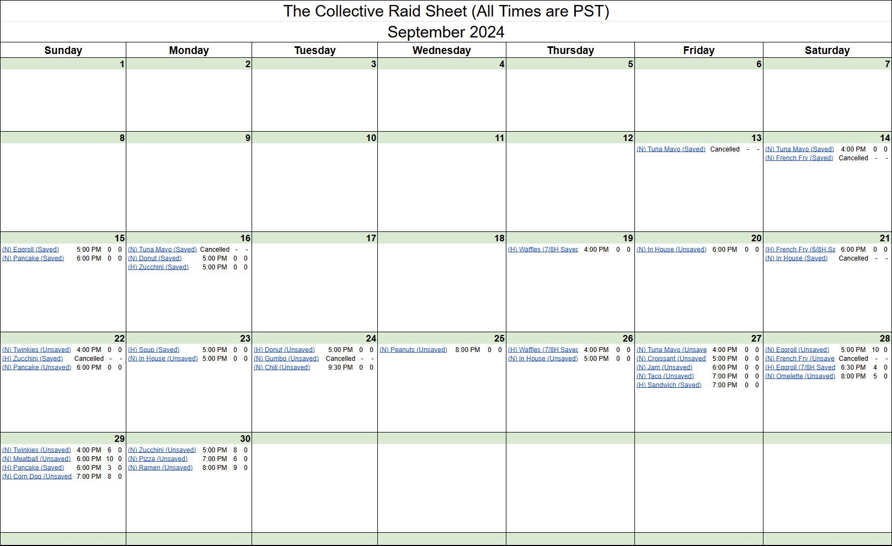

# _**Click image to view full slide deck (6 Slides)**_
  

# Event Capacity Planning: Decision Support Analysis

## Summary
Automated calendar that consolidates event scheduling and real-time capacity data to give sales and operations teams a clear, day-by-day view for planning and decision-making.

## Key Highlights
**Problem:**  
- The department lacked a centralized way to track event details and booking capacity, leading to fragmented data and manual coordination.  

**The Solution:**  
- I built an automated Decision Support System (DSS) that consolidates all event-level data and booking statuses into a single operational calendar.  

**The Result:**  
- Eliminated manual tracking and provided a "single source of truth" for scheduling 50+ monthly events and managing buyer reservations.  
